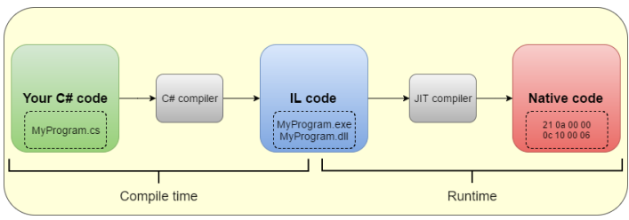

# .NET

* Open-source developer unified platform

* Allows and offers libraries and ready solutions for the construction of different types of systems and applications:
    * Desktop Apps (WPF, Windows Forms, UWP)
    * WEB Apps (ASP.NET)
    * Cloud (Azure)
    * Mobile Apps (Xamarin)
    * Gaming (Unity)
    * IoT (ARM32, ARM34)
    * AI (ML.NET, .NET for Apache Spark)
    * Microservices

* It offers several developer tools:
  * Visual Studio
  * Visual Studio for mac
  * Visual Studio Code
  * Command Line Interface (.NET CLI)

* Cross Platform (*Depending on version):
    * Windows
    * Android
    * Linux (several distributions)
    * macOS

* Active community

### Differences between .NET and .NET Framework (legacy)

  ### .NET Framework (legacy)
  * Legacy version
  * Only works in Windows, is integrated with Windows and comes preinstalled in Windows (applications developed in .NET Framework can't run in other platforms (linux p.ex.))
  * Allows the development of applications: WPF, Windows Forms and ASP.NET (4 and 5)
  * .NET Framework 4.8 is it's last version, receives some maintenance but will not be updated to any new versions

  ### .NET or .NET Core
  * Current version
  * Multi-platform (Windows, Linux, Mac)
    *  Recorded from scratch to work multi-platform
  * Allows the development of applications: ASP.NET 5 (CoreCLR - Win, Linux, Mac) and .NET Native (Microsoft Store - Windows Native apps)
  * Best advantage of being multi-platform:
    * Easy of development for multiple systems
    * Decrease server price (Windows server and license are expensive, and machine used needs to be more robust while linux is free and open-source and doesn't need such a potent machine to run)
    * Possibility of development of application in one platform and running of it in another (p.e development in Windows and running in Linux)

  * In its first versions (until version 3.x) was called **.NET Core**, then Microsoft decides to drop the **Core** (to make the Core version the main version of .NET) word and jumps the 4.0 version (to avoid confusion with the legacy version .NET 4.x), so it's next versions will be called **.NET 5**
    * But as a implementation, .NET Core (1.x to 3.x) and .NET 5.x up are the same just different versions

  | .NET Framework 4.8 | .NET (5.x up)   |
  |-------------------:|---------------- |
  | Legacy version     | Current version |
  | Windows Only      | Multi-platform  |

  #### Both share:
  * Runtime components
  * Libraries
  * Compilers

#### Naming
To understand which version is being referenced use the table:

  | If called | Reference to                            |
  |-------------------:|---------------------------------|
  | .NET Framework     | .NET until 4.x (legacy version) |
  | .NET Core          | .NET Core (versions 1.x to 3.x )|
  | .NET               | .NET (versions 5.x up)          |

### .NET Standard
  * A set of rules (a standardization) that should be obey to guarantee the correct functioning of the code in different platforms
  * A formal specification of .NET APIs, intent on establishing uniformity in the .NET ecosystem

### Libraries
Has a package ecosystem built on .NET standard
#### NuGet
  * NuGet is a package manager built specifically for .NET
  * Has more than 90,000 packages

## Infrastructure

### Runtime Components
### Compilers
### Languages
  * C# (the most used in .NET)
  * F#
  * Visual Basic

## .NET Compiler

#### High-level Languages
  * Programming languages (C#, Python, JS...)

#### Low-level Languages
  * Machine language
  * Little abstractions

#### Compiler
   * Program that makes the conversion from a High-level language to a low-level language (machine language), so that the machine can understand the code to be executed
   * The High-level Code passes for several phases before the machine code is generated
   * Examples of languages that use compiler: C#, Java...

#### Transpiler
  * Translation (Conversion) of an high-level language or implementation to another high-level language, not to machine code
   * Example: Typescript to Javascript

#### Interpreter
  * Reads, interprets and executes the source code (in the high-level language) line by line
  * No binaries, file, or intermediate code is generated
  * Examples of languages that use Interpreter: Python, Ruby, JS...

### .NET Compiler

### Compile time

**1- Your C# code**
Source Code - High level language project that will be compiled, normally has several classes in it

  **2- C# Compiler**
The several classes in the project will be compiled, generating IL Code and this code will be stored in two different files: .exe and .dll
* **IL Code**: Intermediary Language Code
  A language that does not depend of any determined machine or architecture to be executed

### Runtime: CRL (Common Language Runtime)
The CRL is like an virtual machine (Java), gets the IL code and pass through the JIT compiler to generate the native code

**3- JIT Compiler**
  JIT Compiler: Just In Time Compiler
  When the .exe is executed the IL Code (.exe and .dll files) will pass through the JIT compiler, that will convert the code to an native code specific to the architecture of the machine where it's being executed

**4- Native Code**
    Code generated by the JIT Compiler, that is specific for the architecture of the machine where it's being executed

## .NET History
  * The goal was to compete with Java
    * Because Java launched the multi-platform (code once, runs anywhere - any OS) concept, what was a big improvement for Java and a tech revolution, and made Java very popular
    * Microsoft decided to bring Java to Windows, so she modified Java, creating a very close version of it made it specifically to run on Windows, and made improvements to foment Windows
    * But Microsoft didn't have legal permission for all the  modifications she made on Java, so Sun (company that maintained Java at the time) opened a lawsuit against Microsoft, that in the end was obliged to discontinue her Java implementation
    * Then Microsoft came up with the idea for the .NET Framework, that used several of Java's concepts
  * Microsoft starts working on .NET in late nineties (1998)
  * In 2002, the first version of .NET was launched, with the idea of facilitating the development of applications for Windows
    * .NET was a set of libraries that made the complexity of developing applications for Windows decrease drastically, so as to foment Windows as a whole
    * It wasn't multi-platform, and it only worked on Windows

## .NET TimeLine
Not complete, just a overview of some important marks
[Complete TimeLine]()

  * **1998** - Microsoft started working in .NET
  * **2002** - Launch of the first versions of .NET, C# and Visual Studio (.NET 1.0, C# 1.0, Visual Studio .NET 2002)
  * **2004** - Launch of Mono first version (Mono 1.0 -
  Multi-platform .NET implementation oriented for Linux)
  * **2005** - .NET 2.0, C# 2.0
  * **2006** - .NET 3.0
  * **2009** - Windows 7
  * **2010** - .NET 4.0, C# 4.0
  * **2011** - Mono for Android, Xamarian (Android, IOS and Windows Phone) was founded
  * **2012** - Windows 8, .NET 4.5, C# 5.0, Mono 3.0, Visual Studio 2012
  * **2014** - Creation of the .NET Foundation - Organization incorporated by Microsoft to improve open-source development and collaboration in the .NET Framework
  * **2016** - .NET 4.6, Mono is MIT licensed, Xamarin Inc. is bought by Microsoft, **.NET Core 1.0 (multi-platform .NET version)** is launched, .NET standard is created
  * **2018** - Github is acquired by Microsoft
  * **2019** - .NET 4.8 (final version of this .NET implementation), .NET Core 3.0, (from here Microsoft mobilizes its efforts in .NET Core), .NET Core 3.1 C# 8.0
  * **2020** - **.NET 5 (is actually a new version of .NET Core (multi-platform), but they dropped the Core word, they also jumped the 4 version to avoid confusion with the former .NET 4 (Windows only))**
  * **2021** - .NET 6 (.NET Core, without the Core)